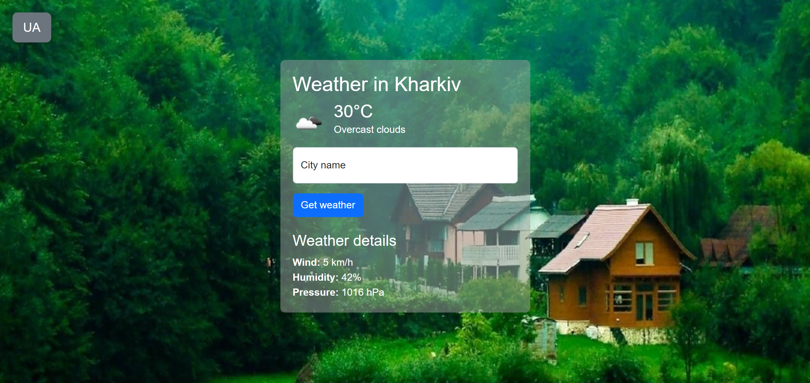
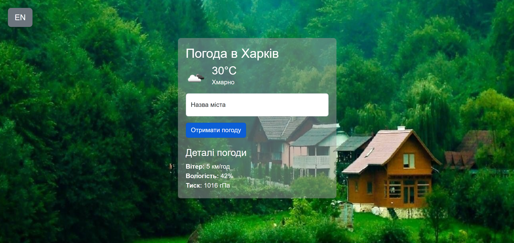

<a href="https://gubchik123-weather-app.netlify.app" target="_blank"></a>
_Static landing page: weather app with Vue.js_

## Demo

[](https://app.netlify.com/sites/gubchik123-weather-app/deploys)

Click **<a href="https://gubchik123-weather-app.netlify.app" target="_blank">here</a>** to open my weather app

<a href="https://gubchik123-weather-app.netlify.app" target="_blank"></a>

### Translation into Ukrainian

There is the ability to switch the page into Ukrainian.
<a href="https://gubchik123-weather-app.netlify.app" target="_blank"></a>

This template should help get you started developing with Vue 3 in Vite.

## Customize configuration

See [Vite Configuration Reference](https://vitejs.dev/config/).

## Project Setup

```sh
npm install
```

### Compile and Hot-Reload for Development

```sh
npm run dev
```

### Compile and Minify for Production

```sh
npm run build
```

### Lint with [ESLint](https://eslint.org/)

```sh
npm run lint
```
